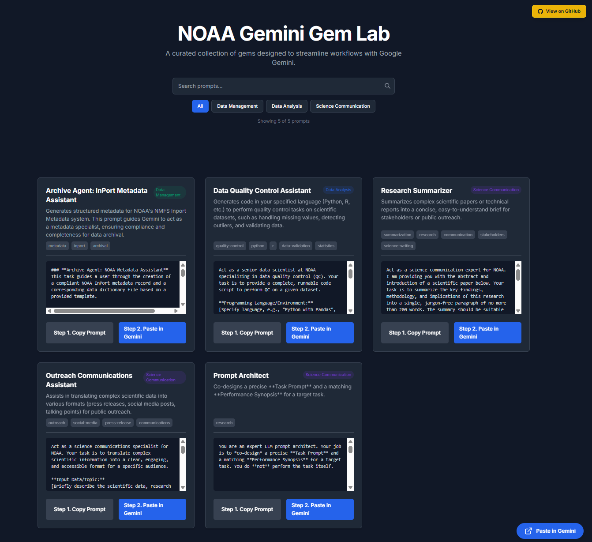

# NOAA Gemini Gem Lab

A curated collection of AI gems (prompts) designed for NOAA workflows and scientific research.
## https://michaelakridge-noaa.github.io/noaa-gem-lab/
<p align="center">
    <a href="https://michaelakridge-noaa.github.io/noaa-gem-lab/">
        
    </a>
</p>


## Features

- 🚀 **Gemini integration**
- 🔍 **Real-time search** 
- 📋 **One-click copying**
- 📝 **Markdown-based prompts**

## Available Prompts in Development

| Prompt | Category | Description |
|--------|----------|-------------|
| **Archive Agent** | Data Management | InPort metadata assistant that generates structured metadata for NOAA's NMFS InPort system, ensuring compliance and completeness for data archival |
| **Data Quality Control** | Data Analysis | Generates code (Python, R, etc.) to perform quality control tasks on datasets including missing value handling, outlier detection, and data validation |
| **Outreach Communications** | Science Communication | Translates complex scientific data into accessible formats like press releases, social media posts, and talking points for public outreach |
| **Research Summarizer** | Science Communication | Summarizes complex scientific papers or technical reports into concise, jargon-free briefs suitable for stakeholders and general audiences |

## Project Structure

```
├── index.html              # Main application
├── config.json             # Site configuration  
└── prompts/                # Markdown prompt files
    ├── manifest.json       # File listing
    └── *.md               # Individual prompts
```

---
#### Disclaimer
This repository is a scientific product and is not official communication of the National Oceanic and Atmospheric Administration, or the United States Department of Commerce. All NOAA GitHub project content is provided on an ‘as is’ basis and the user assumes responsibility for its use. Any claims against the Department of Commerce or Department of Commerce bureaus stemming from the use of this GitHub project will be governed by all applicable Federal law. Any reference to specific commercial products, processes, or services by service mark, trademark, manufacturer, or otherwise, does not constitute or imply their endorsement, recommendation or favoring by the Department of Commerce. The Department of Commerce seal and logo, or the seal and logo of a DOC bureau, shall not be used in any manner to imply endorsement of any commercial product or activity by DOC or the United States Government.

#### License
- Details in the [LICENSE.md](./LICENSE.md) file.
